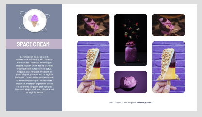

# Projeto Sorveteria

## Conteúdo aprendido

- display grid
- grid-template-areas
- media queries
- at rule css
- variáveis 
- funções var() e clamp()
- css filtros 
- css animações [@keyfames]
- mobile first

